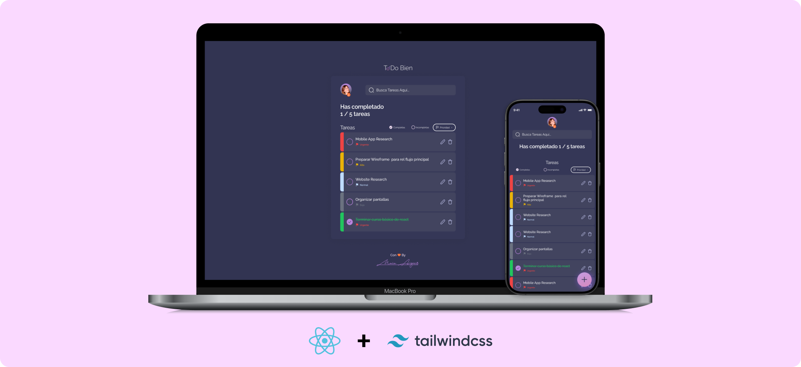

T✅Do Bien is a task list application designed to help you efficiently organize your daily tasks. This project focuses on providing an intuitive and functional interface for managing your to-dos, with key features including:

- **Priority Management:** Assign priorities to your tasks and view them clearly.
- **Advanced Filters and Search:** Filter and search your tasks by priority and completion status.
- **Editing Functionality:** Edit your tasks, including their text and priority, directly from the app.
- **User-Friendly Interface:** Enjoy a smooth user experience with a modern and functional design.

## Features

- **Priority Order:** Classify your tasks into different levels of importance.
- **Complete and Incomplete Filter:** Combine filters with priorities to easily find your tasks.
- **Keyword Search:** Quickly search tasks using keywords.
- **Editing Functionality:** Modify the content and priority of existing tasks.
- **Responsive Interface:** Optimized to work on mobile and desktop devices.

## Technologies Used

- **React:** For a dynamic and responsive user experience.
- **Tailwind CSS:** For a modern and flexible design.
- **LocalStorage:** For data persistence across sessions.

## Installation

To get started with T✅Do Bien, follow these steps:

1. **Clone the Repository:**
   ```bash
   git clone https://github.com/maizner/TodoCheck.git

2. **Navigate to the Project Directory:**
   ```bash
   cd TodoCheck


3. **Install Dependencies:**
   ```bash
   npm install


4. **Start the Application:**
   ```bash
   npm start

## Figma Design Link

You can access the project design on Figma through the following link:


[Design on Figma - Todo Bien](https://www.figma.com/design/GkZBg5chDOoR96RGzemphL/ToDo-Bien?node-id=574-15&t=yMzDLxrxI5sUXayC-1)


## Credits and Acknowledgments
his project was developed based on the course <a href="https://platzi.com/home/clases/7395-react/62326-que-necesitas-para-aprender-reactjs/"> ¿Qué necesitas para aprender React.js?</a> rom Platzi. We give credit and thanks to Platzi and its instructor for providing the foundation of this project.

The original project was based on a public Platzi repository, modified and expanded to include new features and usability improvements.


## Initial Project Documentation
This project was created with Create React App.

- **You can run the following scripts in the project directory:**
   ```bash
   npm start
   npm run build
   npm run eject
npm start: Runs the application in development mode.
npm run build: Builds the application for production in the build folder.
npm run eject: Copies all configuration files so you can customize them.

Check the [Create React App documentation](https://create-react-app.dev/) for more details.


## Contributions
If you would like to contribute to T✅Do Bien, feel free to fork the repository, create a new branch for your changes, and submit a pull request. Any contributions to improve the application are appreciated!

## Contact
For any questions or suggestions, you can contact the project author at maiaaizner@gmail.com.


